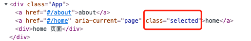

开发 react web 应用，使用的路由库是 `react-router` 中的 web 版本，即 `react-router-dom` 。如果是用 `create-react-app` 脚手架创建的项目，需要单独安装 `react-router-dom`。

`react-router-dom` 中暴露了一些实现路由切换的组件，也是我们要学习的部分。


## Link，Route，BrowserRouter

使用这三个组件就可以完成路由切换，先看例子再介绍：

```js
import {Link, Route, BrowserRouter} from 'react-router-dom'
```

```jsx
<BrowserRouter>
  <Link to="/home">home</Link>
  <Link to="/about">about</Link>

  <Route path='/home'> <Home/> </Route>
  <Route path='/about'> <About/> </Route>
</BrowserRouter>
```


`Link` 组件，相当于 `a` 标签，其实最终在页面上也是渲染成 `a` 标签，它的作用就是切换路由的，当点击时，会激活对应的路由路径，它的 `to` 属性就是标记路由路径的。用过 vue 的一定熟悉 `<router-link>`，跟 `Link`类似。 


`Route` 组件，用于注册路由，`path` 属性匹配当前路由路径，，component 属性传入当前路径匹配的组件，当 `path` 匹配到时，就渲染 `component` 传入的组件。

也可以将要渲染的组件，直接写在组件标签中，如下：

```jsx
<Route path='/home'> <Home/> </Route>
<Route path='/about'> <About/> </Route>
```

添加 `exact` 开启严格匹配模式，即 path 值需要跟 `Link` 中的 to 的值一致时才匹配。

`BrowserRouter` 组件，不知道怎么解释比较好，可以理解为要在路由应用的最外层，使用 BrowserRouter 包裹。

其实更准确一点应该是将互相映射的 `Link` 和 `Route` （不知道这么表达对不对）包裹在同一个 `BrowserRouter` 下，也就是说如果像下面这样分开包裹就是错的：

```jsx
<BrowserRouter>
  <Link to="/home">home</Link>
  <Link to="/about">about</Link>
</BrowserRouter>

<BrowserRouter>
  <Route path='/home' component={Home}></Route>
  <Route path='/about' component={About}></Route>
</BrowserRouter>
```

分开使用 `BrowserRouter`包裹，是无法匹配到对应组件的。有时为了方便，可以将 `BrowserRouter` 组件应用到入口文件中，如下：

```jsx
ReactDOM.render(
  <BrowserRouter>
      <App />
  </BrowserRouter>,
  document.getElementById('root')
);
```

这样在你的组件中就不需要再引入 `BrowserRouter` 了，可以随意位置写 `Link` 和 `Route` 了。

实际开发中，也不会像开头的例子一样，将它们全写在一起，这样不灵活，只需记住，互相匹配的 Link 和 Route 在同一个 `BrowserRouter` 即可。


## HashRouter

作用与 `BrowserRouter` 一样，只是从 history 式路由，变成 hash 式路由。

跟 vue-router 中一样的，一般 SPA 应用都有这两种路由模式，原理这里就不再展开说明，社区有很多相关文章。


## NavLink

作用与 `Link` 一样，只是在路由激活时，会在渲染后的 a 标签上加上 `active` 类名 ，这样的好处就是可以定义路由激活时的样式，只需要对 active 类定义样式。

同时可以修改激活时的类名，使用 `activeClassName` 属性自定义激活类名：

```jsx
<NavLink activeClassName="selected" to="/about">about</NavLink>
<NavLink activeClassName="selected" to="/home">home</NavLink>
```




## Switch

`Switch` 组件用来包裹 `Route` 的，它可以提高路由匹配效率，Route 匹配路由时，即使匹配到了还会继续往后面匹配，例如：

```jsx
<Route path='/home' component={Home}></Route>
<Route path='/home' component={Test}></Route>
```

上面代码中两个 `Route` 匹配的 `path` 都是 `/home`，最终 `Home` 和 `Test` 组件都会渲染到页面。

如果有很多个 `Route`，也会一直往后面匹配直至结束，这显然影响效率。

如果要避免这种情况，就可以使用 `Switch` 包裹，这样就是单一路由匹配，匹配到就结束。

```jsx
<Switch>
	<Route path='/home' component={Home}></Route>
  <Route path='/home' component={Test}></Route>
</Switch>
```

此时，`Test` 组件就不会再匹配。

## Redirect

重定向组件，可以在匹配规则后重定向到指定路由。

当用在 `Switch` 中时，可以将 `Redirect` 放到最后面用于“兜底”作用，即上面所有的路由都没匹配到时，重定向，例：

```jsx
<Switch>
  <Route path='/home' component={Home}></Route>
  <Route path='/about' component={About}></Route>
  // 当上面两个都没匹配到时，重定向到 /home
  <Redirect to="/home" />
</Switch>
```

当直接用在组件中时，组件渲染时就会触发重定向：

```jsx
import React, { Component } from 'react'
import { Redirect } from 'react-router-dom'

export default class Test extends Component {
    render() {
        return (
            <div>
                Test 组件，当我渲染时会重定向到 /about
                <Redirect to='/about' />
            </div>
        )
    }
}
```

